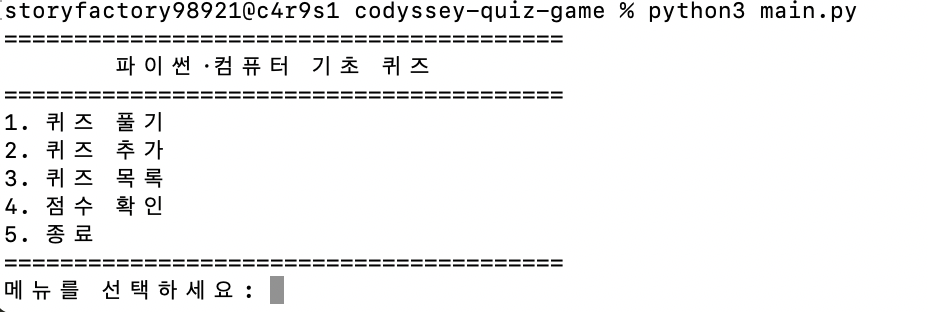
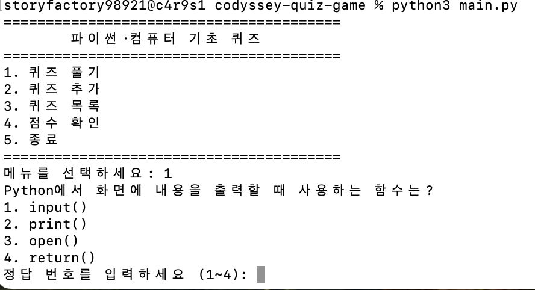
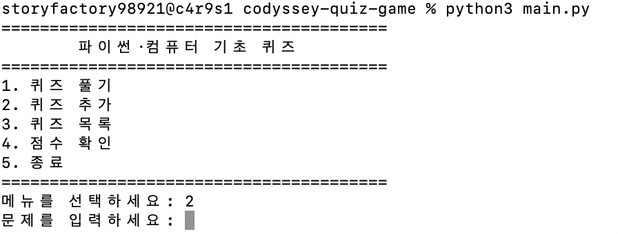
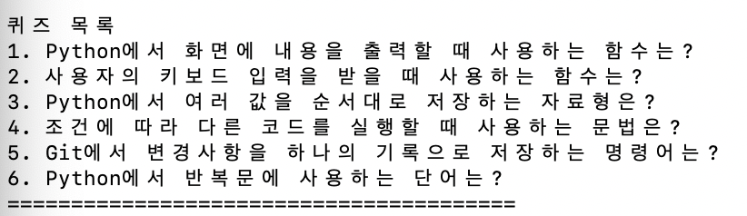
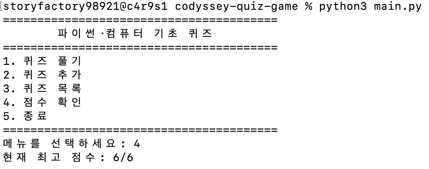

# Python Console Quiz Game

## 프로젝트 개요

Python 기초 문법과 컴퓨터 지식을 학습할 수 있는 터미널 기반 퀴즈 게임입니다.

## 퀴즈 주제와 선정 이유

퀴즈의 주제는 Python 기초 문법과 Git·컴퓨터 기초 지식입니다.  
이번 프로젝트에서 직접 사용한 `print()`, `input()`, 조건문, 리스트, Git 명령어 등을 문제로 구성했습니다.

프로그램을 만드는 과정에서 학습한 내용을 다시 퀴즈로 풀어보면 핵심 개념을 반복해서 확인할 수 있다고 생각해 이 주제를 선정했습니다. 또한 사용자가 새로운 문제를 직접 추가할 수 있어 학습 범위를 계속 확장할 수 있도록 설계했습니다.

## 주요 기능

- 객관식 퀴즈 풀기
- 정답과 오답 확인
- 퀴즈 추가
- 전체 퀴즈 목록 확인
- 최고 점수 확인
- 퀴즈와 최고 점수를 JSON 파일에 저장
- 프로그램 재실행 시 저장 데이터 불러오기
- 잘못된 입력 예외 처리
- 저장 파일이 없거나 손상된 경우 기본 퀴즈 사용
- `Ctrl+C` 입력 시 안전하게 저장하고 종료

## 실행 방법

프로젝트 폴더에서 다음 명령어를 실행합니다.

```bash
python3 main.py
```

## 메뉴

```text
1. 퀴즈 풀기
2. 퀴즈 추가
3. 퀴즈 목록
4. 점수 확인
5. 종료
```

## 프로젝트 파일

```text
codyssey-quiz-game/
├── main.py
├── state.json
├── README.md
└── .gitignore
```

* `main.py`: 퀴즈 게임 실행 코드
* `state.json`: 퀴즈 목록과 최고 점수 저장
* `README.md`: 프로젝트 설명
* `.gitignore`: Git에서 제외할 파일 설정

## 프로그램 구조

### Quiz 클래스

개별 퀴즈의 문제, 선택지, 정답을 관리합니다.

### QuizGame 클래스

퀴즈 진행, 퀴즈 추가, 점수 확인, JSON 저장 기능을 관리합니다.

## 데이터 파일 설명

- 경로: 프로젝트 루트의 `state.json`
- 인코딩: UTF-8
- 역할: 사용자가 추가한 퀴즈 목록과 최고 점수를 저장합니다.
- 프로그램 시작 시 `state.json`을 읽어 이전 데이터를 복원합니다.
- 파일이 없으면 기본 퀴즈로 시작합니다.
- 파일이 손상되었거나 읽을 수 없으면 오류 메시지를 출력하고 기본 퀴즈를 사용합니다.

### 필드 구조

- `quizzes`: 퀴즈 객체를 저장하는 배열
  - `question`: 문제 내용
  - `choices`: 4개의 선택지 목록
  - `answer`: 정답 선택지 번호
- `high_score`: 지금까지 기록한 최고 정답 개수

## 저장 데이터 예시

```json
{
  "quizzes": [
    {
      "question": "Python에서 화면에 내용을 출력할 때 사용하는 함수는?",
      "choices": [
        "input()",
        "print()",
        "open()",
        "return()"
      ],
      "answer": 2
    }
  ],
  "high_score": 0
}
```
## 실행 화면

### 메뉴 화면



### 퀴즈 풀기



### 퀴즈 추가



### 퀴즈 목록



### 최고 점수 확인



## 개발 환경

* Python 3.12
* Git
* GitHub
* Visual Studio Code


Git 저장소 복제 및 pull 실습을 완료했습니다.
